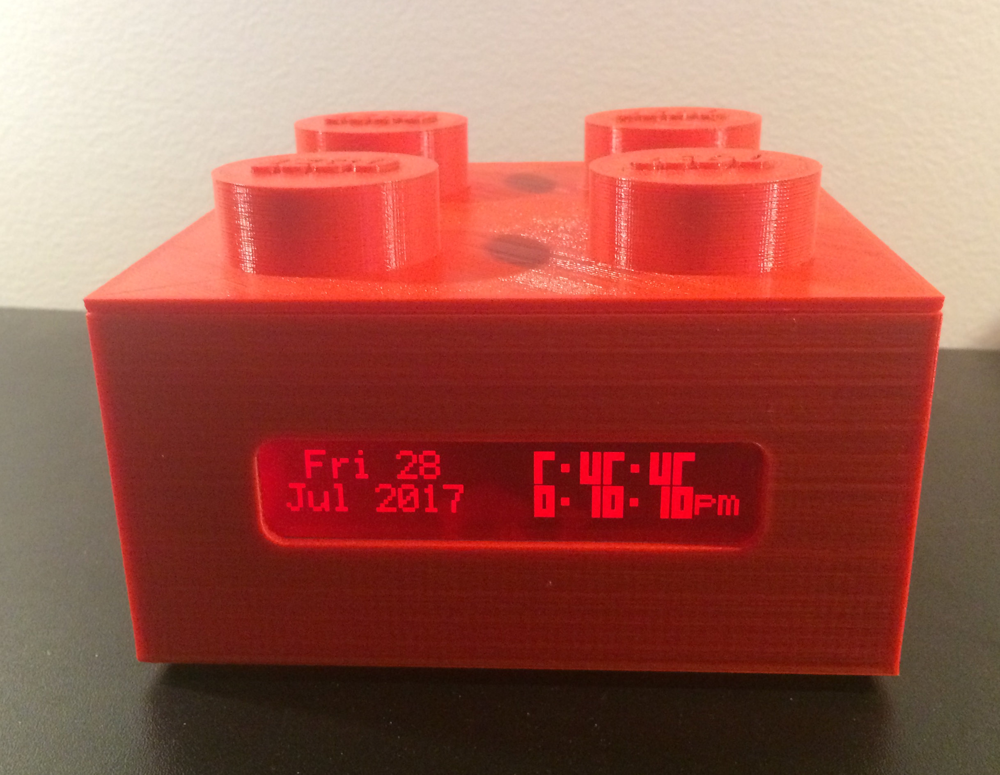
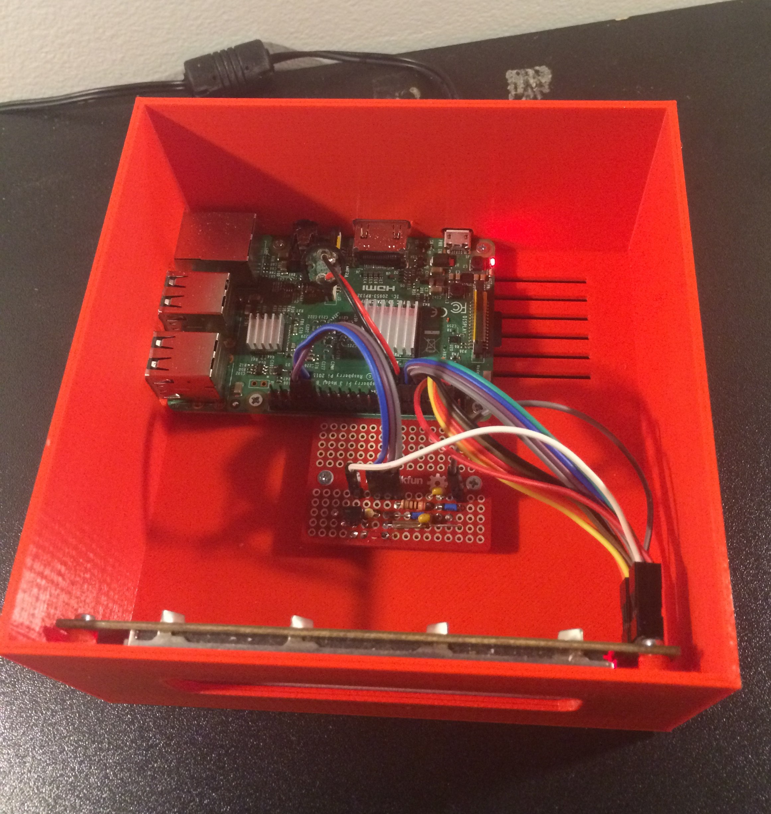

Lego-LCD
========

This project is the source code and 3D models of a small project of mine to 3D print a large Lego
with a Raspberry Pi inside running a small LCD showing a clock.


LCD Library
-----------
The lcd library in lcd.pyx supports any HD44780-compatible LCD hooked up to the Raspberry Pi. You
have to tell it which GPIO pins to use, but then can use the LCD screen from the Raspberry Pi. It
supports both 4-bit and 8-bit interfaces. It does not support contrast or backlight (since they
are not fully standardized and require additional electrical components instead of directly
connecting the LCD). The LCD logic is all wrapped up in the `LCD` class which is constructed with
the pin numbers and sets up the display. That Cython file also exports a few wiringPi functions
from the underlying C library it uses. At least one of the `wiringPiSetup()` functions must be
called before setting up an LCD.


LCD-Helper
----------
I created a small set of pure-Python functions for using with my specific LCD screen that adds
support for:

- Backlight and contrast setting (requires additional electrical components, see the circuit below)
- Function to translate limited sets of unicode to the built in character set of my LCD screen

This file can be used for inspiration on setting it up for your own LCD screen.


clock
-----
Code to run the clock using big numbers (utilizing custom characters).


wifi_connect
------------
Implements a captive hotspot portal on the Raspberry Pi that allows it to connect to Wifi networks
by using another device such as your phone. See its readme for more details. It has almost nothing
LCD or Lego related (except in the graphics on the webpage).


Installation on Raspberry Pi
----------------------------

```sh
# Clone the repo
sudo apt install git
git clone https://github.com/coderforlife/lego-lcd.git
cd lego-lcd

# Create a virtual environment
python3 -m venv venv
. venv/bin/activate

# Install the dependencies and the application itself
bash install-deps.sh
pip install -e .

# Install, enabled, and run the service
sudo cp lcd-clock.service /etc/systemd/system/
sudo systemctl daemon-reload
sudo systemctl enable --now lcd-clock.service
```

3D Model
--------

The 3D model is available in the Lego-Box.stl and Lego-Lid.stl files. It is precisely 8x larger than
a regular Lego (but without the indents underneath and exaggerated logos raised from the nubs). To
complete the assembly you need 10 heat set inserts such as
[these from McMaster Carr](https://www.mcmaster.com/94180A312/).


Circuit and Components
----------------------

The case is based around a Raspberry Pi 3B, but any Raspberry Pi from the first one till 3 should
fit all of the holes. Raspberry Pi 4 changed the plugs and thus won't fit without a redesign.

It is designed around a
[CrystalFontz 20x2 CFAH2002Y-RDI-ET LCD](https://www.crystalfontz.com/product/cfah2002yrdiet-character-display-20x2).
However, that product is discontinued. They should have other 20x2 screens that fit, but they seem
to no longer carry red colored serial displays.

Additionally, breadboard is needed for running the adjustable backlight and contrast. I use the
[SparkFun Solder-able Breadboard - Mini](https://www.sparkfun.com/products/12702).

Finally, several small components are needed including capacitors, resistors, transistors, header
pins, and wires with terminals. I don't have an exact list anymore, but I will try to recreate it.

Photos
------


